# --------------- EXPERIMENT-9 ----------

# Program - 1 (Write a PL/SQL program to create a BEFORE INSERT trigger that validates data before inserting a record into a table.)
```
CREATE TABLE student (
    student_id   NUMBER(5) PRIMARY KEY,
    student_name VARCHAR2(50),
    course       VARCHAR2(30),
    marks        NUMBER(5,2)
);

CREATE OR REPLACE TRIGGER trg_student_before_insert
BEFORE INSERT ON student
FOR EACH ROW
BEGIN
    IF :NEW.student_id <= 0 THEN
        RAISE_APPLICATION_ERROR(-20001, 'Student ID must be greater than 0.');
    END IF;

    IF :NEW.student_name IS NULL THEN
        RAISE_APPLICATION_ERROR(-20002, 'Student Name cannot be NULL.');
    END IF;

    IF :NEW.marks < 0 OR :NEW.marks > 100 THEN
        RAISE_APPLICATION_ERROR(-20003, 'Marks must be between 0 and 100.');
    END IF;
END;
/

INSERT INTO student VALUES (101, 'Ravi', 'CSE', 85);

COMMIT;

INSERT INTO student VALUES (102, 'Sita', 'ECE', 120);
```
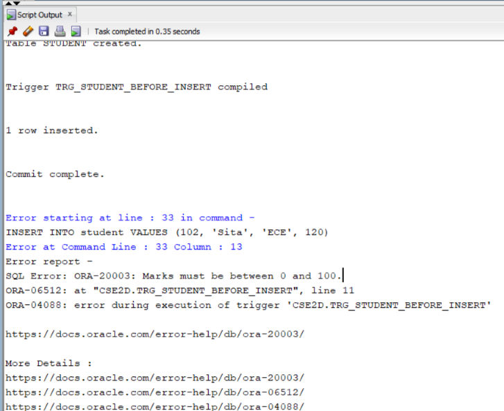


# Program 2: AFTER Trigger (Write a PL/SQL program to create an AFTER INSERT trigger that automatically records the inserted data into an audit table.)
```
CREATE TABLE student (
    student_id   NUMBER(5) PRIMARY KEY,
    student_name VARCHAR2(50),
    course       VARCHAR2(30),
    marks        NUMBER(5,2)
);

CREATE TABLE student_audit (
    audit_id     NUMBER(5),
    student_id   NUMBER(5),
    student_name VARCHAR2(50),
    course       VARCHAR2(30),
    marks        NUMBER(5,2),
    action       VARCHAR2(20),
    action_date  DATE
);

CREATE SEQUENCE student_audit_seq
START WITH 1
INCREMENT BY 1;

CREATE OR REPLACE TRIGGER trg_student_after_insert
AFTER INSERT ON student
FOR EACH ROW
BEGIN
    INSERT INTO student_audit (
        audit_id, student_id, student_name, course, marks, action, action_date
    )
    VALUES (
        student_audit_seq.NEXTVAL,
        :NEW.student_id,
        :NEW.student_name,
        :NEW.course,
        :NEW.marks,
        'INSERT',
        SYSDATE
    );
END;
/

INSERT INTO student VALUES (101, 'Ravi', 'CSE', 85);

COMMIT;
```
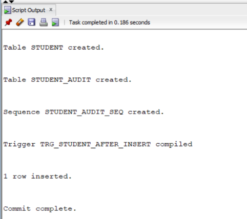


# Program 3: Row-Level Trigger (Write a PL/SQL program to create a BEFORE UPDATE Row-Level trigger that validates updated values using the: OLD and: NEW pseudo records.)
```
CREATE TABLE employee (
    employee_id   NUMBER(5) PRIMARY KEY,
    employee_name VARCHAR2(50),
    department    VARCHAR2(30),
    salary        NUMBER(10,2)
);
```
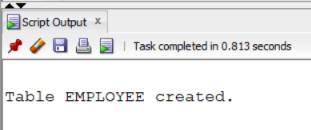

```
INSERT INTO employee VALUES (101, 'Ravi',   'CSE', 30000);
INSERT INTO employee VALUES (102, 'Sita',   'ECE', 35000);
INSERT INTO employee VALUES (103, 'Kiran',  'EEE', 40000);
INSERT INTO employee VALUES (104, 'Anjali', 'CSE', 45000);

COMMIT;

CREATE OR REPLACE TRIGGER trg_employee_before_update
BEFORE UPDATE ON employee
FOR EACH ROW
BEGIN
    IF :NEW.salary < :OLD.salary THEN
        RAISE_APPLICATION_ERROR(-20001, 'Salary cannot be decreased.');
    END IF;
END;
/

UPDATE employee
SET salary = 33000
WHERE employee_id = 101;

COMMIT;
```
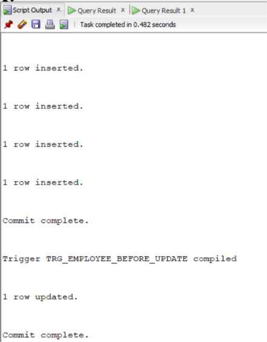

```
SELECT * FROM employee
WHERE employee_id = 101;
```
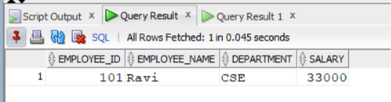

```
UPDATE employee
SET salary = 28000
WHERE employee_id = 101;
```
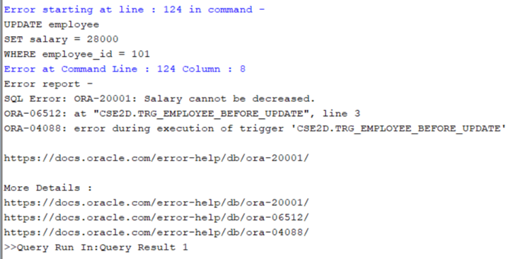


```
SELECT * FROM employee;
```
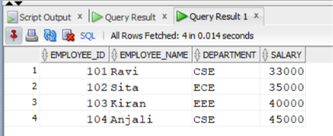


# Program 4: Statement-Level Trigger (Write a PL/SQL program to create an AFTER DELETE Statement-Level trigger that displays a message or records the delete operation after the DELETE statement is executed.)
```
SET SERVEROUTPUT ON;

CREATE TABLE employee (
    employee_id   NUMBER(5) PRIMARY KEY,
    employee_name VARCHAR2(50),
    department    VARCHAR2(30),
    salary        NUMBER(10,2)
);
```


```
INSERT INTO employee VALUES (101, 'Ravi',   'CSE', 30000);
INSERT INTO employee VALUES (102, 'Sita',   'ECE', 35000);
INSERT INTO employee VALUES (103, 'Kiran',  'EEE', 40000);
INSERT INTO employee VALUES (104, 'Anjali', 'CSE', 45000);
INSERT INTO employee VALUES (105, 'Rahul',  'ECE', 38000);

COMMIT;
```
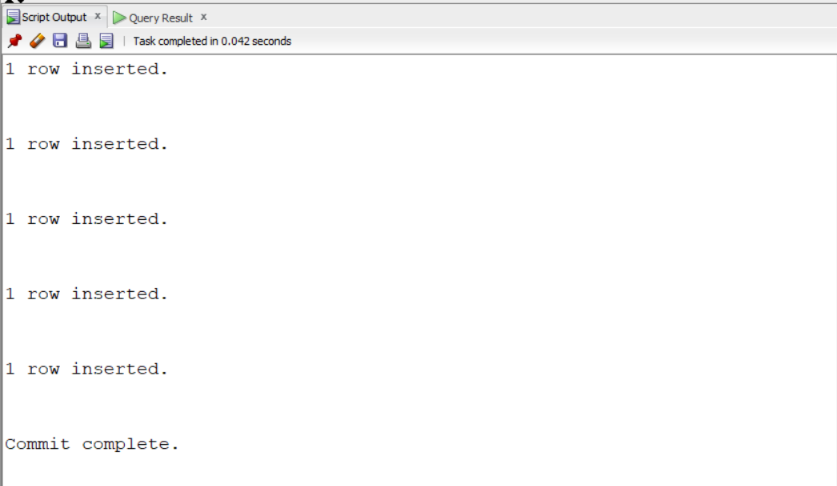

```
CREATE TABLE employee_delete_log (
    log_id      NUMBER(5),
    message     VARCHAR2(200),
    delete_date DATE
);

CREATE SEQUENCE employee_delete_log_seq
START WITH 1
INCREMENT BY 1;

CREATE OR REPLACE TRIGGER trg_employee_after_delete
AFTER DELETE ON employee
BEGIN
    INSERT INTO employee_delete_log (log_id, message, delete_date)
    VALUES (
        employee_delete_log_seq.NEXTVAL,
        'DELETE statement executed on EMPLOYEE table.',
        SYSDATE
    );

    DBMS_OUTPUT.PUT_LINE('DELETE statement executed successfully.');
END;
/
```
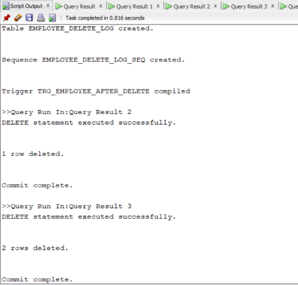

```
SELECT trigger_name, status
FROM user_triggers
WHERE trigger_name = 'TRG_EMPLOYEE_AFTER_DELETE';
```
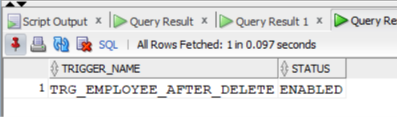

```
DELETE FROM employee
WHERE employee_id = 101;

COMMIT;

SELECT * FROM employee;
```
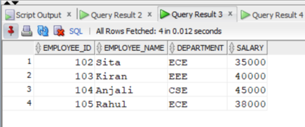

```
DELETE FROM employee
WHERE department = 'ECE';

COMMIT;
SELECT * FROM employee;
```


```
SELECT * FROM employee_delete_log;
```
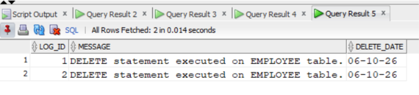


# Program 5: INSTEAD OF Trigger (Write a PL/SQL program to create an INSTEAD OF UPDATE trigger on a view to update the corresponding records in the underlying base table.)
```
CREATE TABLE course (
    course_id   NUMBER(5) PRIMARY KEY,
    course_name VARCHAR2(50)
);

CREATE TABLE student (
    student_id   NUMBER(5) PRIMARY KEY,
    student_name VARCHAR2(50),
    course_id    NUMBER(5),
    marks        NUMBER(5,2),
    CONSTRAINT fk_student_course
        FOREIGN KEY (course_id)
        REFERENCES course(course_id)
);

INSERT INTO course VALUES (1, 'Computer Science');
INSERT INTO course VALUES (2, 'Electronics');
INSERT INTO course VALUES (3, 'Electrical');

COMMIT;
```
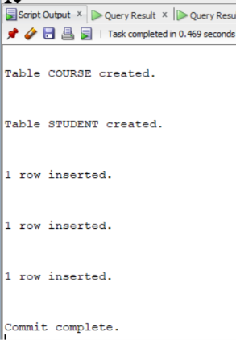

```
INSERT INTO student VALUES (101, 'Ravi',   1, 85);
INSERT INTO student VALUES (102, 'Sita',   2, 90);
INSERT INTO student VALUES (103, 'Kiran',  3, 78);
INSERT INTO student VALUES (104, 'Anjali', 1, 88);

COMMIT;
```
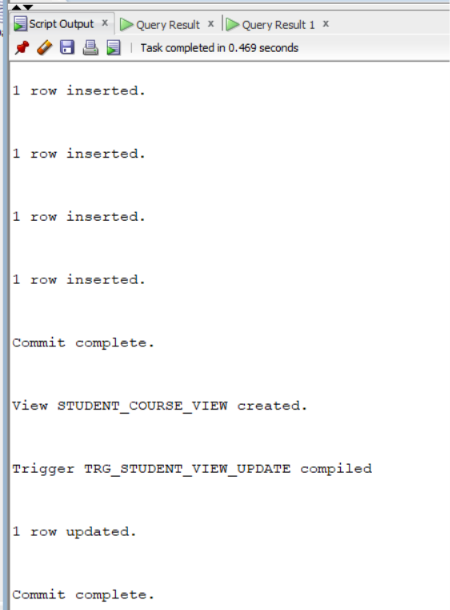

```
CREATE OR REPLACE VIEW student_course_view AS
SELECT s.student_id, s.student_name,s.course_id,c.course_name,s.marks
FROM student s
JOIN course c
    ON s.course_id = c.course_id;

CREATE OR REPLACE TRIGGER trg_student_view_update
INSTEAD OF UPDATE ON student_course_view
FOR EACH ROW
BEGIN
    UPDATE student
    SET student_name = :NEW.student_name,
        marks        = :NEW.marks
    WHERE student_id = :OLD.student_id;
END;
/
UPDATE student_course_view
SET marks = 95
WHERE student_id = 101;

COMMIT;
```


```
SELECT * FROM student;
```
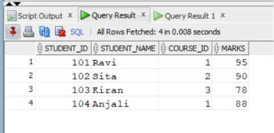

```
SELECT * FROM student_course_view;
```
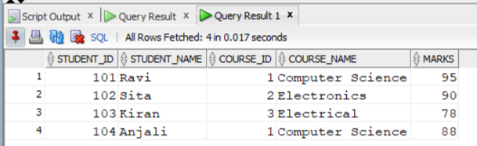

