# (1.a) 1.Create the tables without using constraints
```
CREATE TABLE Student
(
    Name VARCHAR2(30),
    Student_number NUMBER,
    Class NUMBER,
    Major VARCHAR2(20)
);

CREATE TABLE Course
(
    Course_name VARCHAR2(50),
    Course_number VARCHAR2(10),
    Credit_hours NUMBER,
    Department VARCHAR2(20)
);

CREATE TABLE Section
(
    Section_identifier NUMBER,
    Course_number VARCHAR2(10),
    Semester VARCHAR2(10),
    Year NUMBER,
    Instructor VARCHAR2(30)
);

CREATE TABLE Grade_Report
(
    Student_number NUMBER,
    Section_identifier NUMBER,
    Grade VARCHAR(5)
);

```
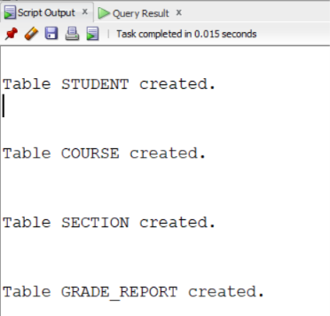


#(1.a) 2.Insert all values inside the table

```
INSERT INTO Student VALUES ('Smith',17,1,'CS');

INSERT INTO Student VALUES ('Brown',8,2,'CS');


INSERT INTO Course VALUES
('Intro to Computer Science','CS1310',4,'CS');

INSERT INTO Course VALUES
('Data Structures','CS3320',4,'CS');

INSERT INTO Course VALUES
('Discrete Mathematics','MATH2410',3,'MATH');

INSERT INTO Course VALUES
('Database','CS3380',3,'CS');
```
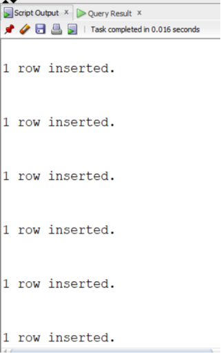


```
INSERT INTO Section VALUES
(85,'MATH2410','Fall',7,'King');

INSERT INTO Section VALUES
(92,'CS1310','Fall',7,'Anderson');

INSERT INTO Section VALUES
(102,'CS3320','Spring',8,'Knuth');

INSERT INTO Section VALUES
(112,'MATH2410','Fall',8,'Chang');

INSERT INTO Section VALUES
(119,'CS1310','Fall',8,'Anderson');

INSERT INTO Section VALUES
(135,'CS3380','Fall',8,'Stone');
```
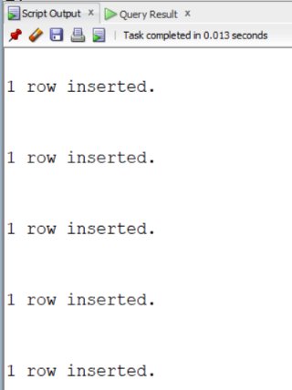


```
INSERT INTO Grade_Report VALUES
(17,112,'B');

INSERT INTO Grade_Report VALUES
(17,119,'C');

INSERT INTO Grade_Report VALUES
(8,85,'A');

INSERT INTO Grade_Report VALUES
(8,92,'A');

INSERT INTO Grade_Report VALUES
(8,102,'B');

INSERT INTO Grade_Report VALUES
(8,135,'A');

```
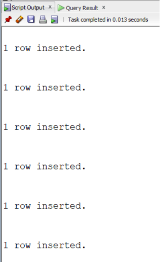


# (1.a) 3.Describe all the tables


```
DESC Student;

DESC Course;

DESC Section;

DESC Grade_Report;

```
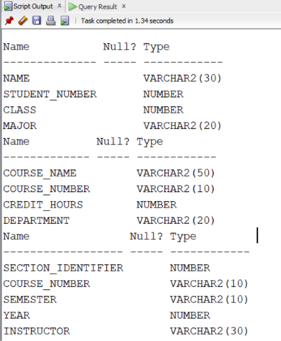
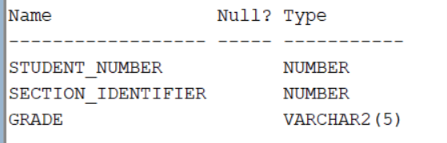


# (1.a) 4.List the created tables
```
SELECT * FROM tab;
```

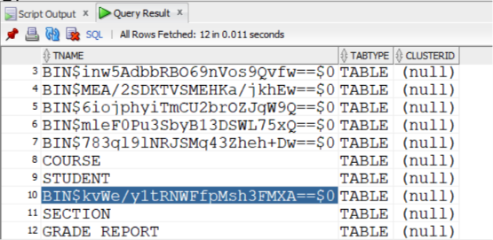


# (1.a) 5.Display the values of each table 

```
SELECT * FROM Student;
```
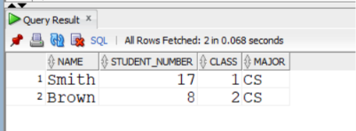


```
SELECT * FROM Course;
```
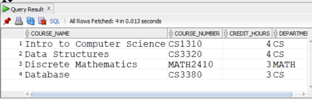


```
SELECT * FROM Section;
```
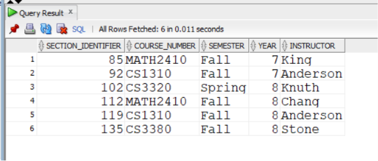


```
SELECT * FROM Grade_Report;
```
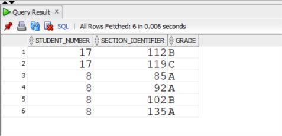


# (1.a) 6.Delete all tables
```
DROP TABLE Grade_Report;
```

```
DROP TABLE Section;
```

```
DROP TABLE Course;
```

```
DROP TABLE Student;
```
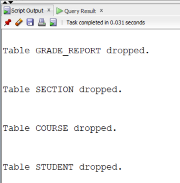


