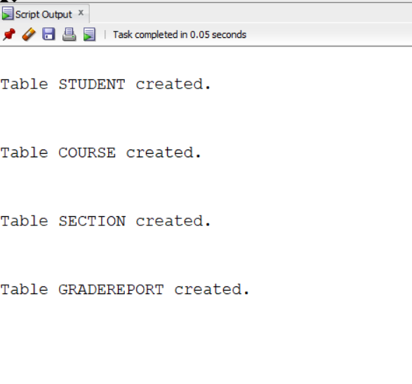
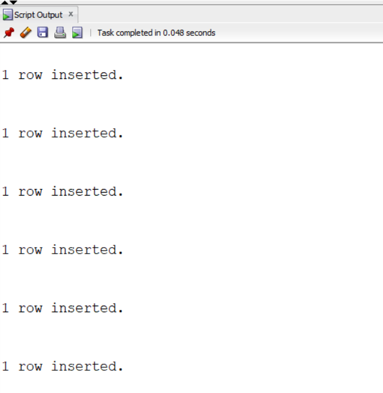
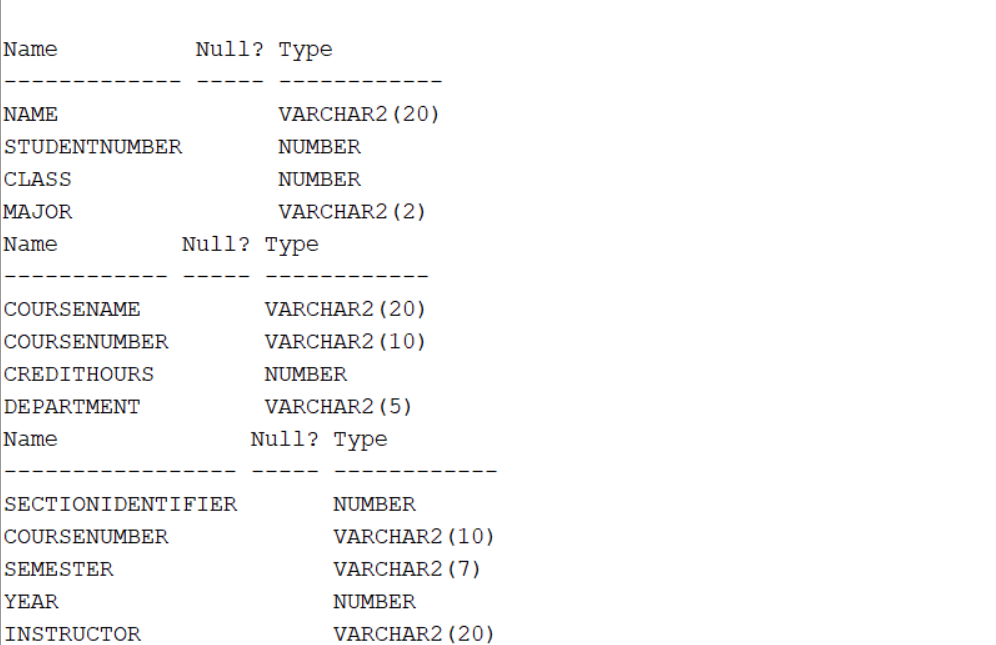
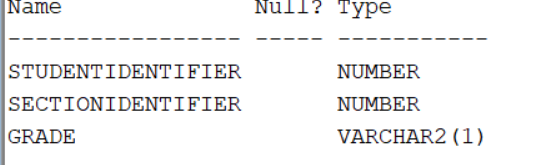
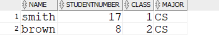
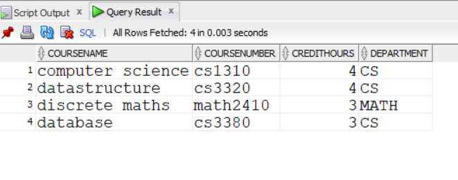
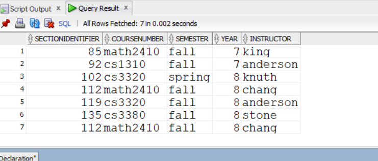
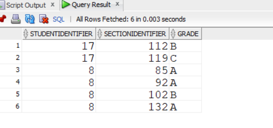
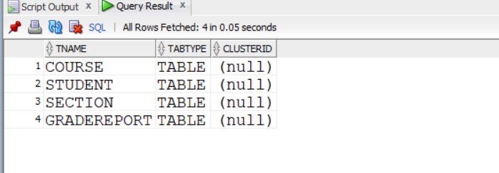
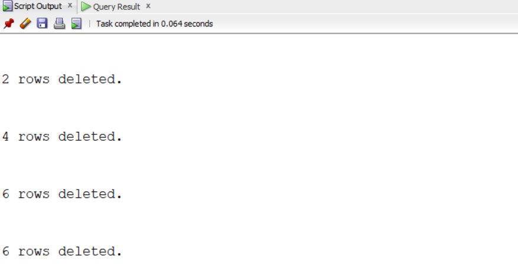

#creating tables
```
create table student(
name varchar2(20),
studentnumber number,
class number,major varchar2(2));
create table course
(
coursename varchar2(20),
coursenumber varchar2(10),
credithours number,
department varchar2(5));

create table section(
sectionidentifier number,
coursenumber varchar2(10),
semester varchar2(7),
year number,
instructor varchar2(20)
);
create table gradereport(
studentidentifier number ,
sectionidentifier number,
grade varchar2(1));

```



#INSERT ALL ROWS
```
insert into student
values('smith',17,1,'CS');
insert into student
values ('brown',8,2,'CS');

insert into course
values('computer science','cs1310',4,'CS');
insert into course
values('datastructure','cs3320',4,'CS');
insert into course
values('discrete maths','math2410',3,'MATH');
insert into course
values('database','cs3380',3,'CS');

insert into section
values(85,'math2410','fall',7,'king');
insert into section
values(92,'cs1310','fall',7,'anderson');
insert into section
values(102,'cs3320','spring',8,'knuth');
insert into section
values(112,'math2410','fall',8,'chang');
insert into section
values(119,'cs3320','fall',8,'anderson');
insert into section
values(135,'cs3380','fall',8,'stone');

insert into gradereport
values(17,112,'B');
insert into gradereport
values(17,119,'C');
insert into gradereport
values(8,85,'A');
insert into gradereport
values(8,92,'A');
insert into gradereport
values(8,102,'B');
insert into gradereport
values(8,132,'A');


```



```
DESC student;
DESC course;
DESC section;
DESC gradereport;

```



```
select *from student;
select *from course;
select *from section;
select *from gradereport;

```





```
select *from tab;

```


```
DELETE FROM STUDENT;
DELETE FROM  course;
DELETE FROM section;
DELETE FROM gradereport;

```


